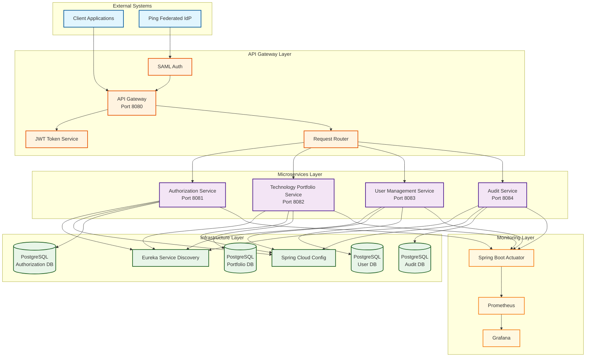

# Technology Portfolio SSO Management System

A comprehensive microservices-based system for managing technology portfolios with Single Sign-On (SSO) authentication, built with Spring Boot 3.4, Kotlin, and following hexagonal architecture principles.

## 🎯 Overview

This system provides enterprise-grade technology portfolio management with robust authentication and authorization. It supports two authentication modes:

1. **🔐 SAML SSO Mode**: Full SAML 2.0 authentication with SimpleSAMLphp Identity Provider
2. **⚡ Mock Authentication Mode**: Lightweight mock authentication for development and testing

### Architecture

- **API Gateway**: Central entry point with authentication and routing
- **Authorization Service**: Role-based access control and user management
- **Technology Portfolio Service**: Core portfolio management functionality
- **Shared Module**: Common domain models and interfaces

### Technology Stack

- **Framework**: Spring Boot 3.4 with Kotlin
- **Architecture**: Hexagonal Architecture with CQRS and Event-Driven patterns
- **Authentication**: SAML 2.0 or Mock Authentication
- **Database**: PostgreSQL with JPA/Hibernate
- **Caching**: Redis
- **Service Discovery**: Netflix Eureka
- **Monitoring**: Prometheus + Grafana
- **Containerization**: Docker & Docker Compose

## 🚀 Quick Start

### Prerequisites

- Docker and Docker Compose (for containerized setup)
- At least 4GB RAM available
- Java 21 (for local development)
- Gradle 8.x (for local development)

### Choose Your Deployment Method

#### 🔧 Option A: Local Development with Gradle (Recommended for Development)

**Run directly with Gradle - fastest development cycle:**

```bash
# Quick start - everything automated
./run-local.sh

# Stop all services
./stop-local.sh

# Manual control
./gradlew startInfrastructure  # PostgreSQL, Redis, Eureka
./gradlew runApiGateway        # Start API Gateway
./gradlew runAuthorizationService
./gradlew runPortfolioService
```

**See [GRADLE_LOCAL_DEVELOPMENT.md](GRADLE_LOCAL_DEVELOPMENT.md) for detailed guide.**

#### 🐳 Option B: Docker Compose (Production-like)

### Choose Your Authentication Mode

#### ⚡ Option 1: Mock Authentication (Recommended for Development)

**Fastest startup, no external dependencies:**

```bash
# Start with mock authentication
chmod +x docker-start-mock.sh
./docker-start-mock.sh
```

**Access the system:**
- 🔐 Mock Login: http://localhost:8081/mock-login
- 🚪 API Gateway: http://localhost:8081
- Test Users: `user1`/`password`, `user2`/`password`, `admin`/`secret`

#### 🔐 Option 2: Full SAML SSO (Production-like)

**Complete SAML setup with SimpleSAMLphp Identity Provider:**

```bash
# Start with SAML authentication
chmod +x docker-start.sh
./docker-start.sh
```

**Access the system:**
- 🔐 SimpleSAMLphp IdP: http://localhost:8080/simplesaml/
- 🚪 API Gateway: http://localhost:8081
- Test Users: `user1`/`password`, `user2`/`password`, `admin`/`secret`

## 🧪 Testing Authentication

### Mock Authentication Testing

```bash
# Get available test users
curl http://localhost:8081/api/auth/mock-users

# Login programmatically
curl -X POST http://localhost:8081/api/auth/mock-login \
  -H 'Content-Type: application/json' \
  -d '{"username": "user1", "password": "password"}'

# Use JWT token for API calls
curl -X GET http://localhost:8081/api/portfolios \
  -H 'Authorization: Bearer YOUR_JWT_TOKEN'
```

### SAML Authentication Testing

1. Visit: http://localhost:8081/saml/login
2. Authenticate with SimpleSAMLphp
3. Receive JWT token and access APIs

## 📋 Service URLs

| Service | Mock Mode | SAML Mode | Description |
|---------|-----------|-----------|-------------|
| **Authentication** | http://localhost:8081/mock-login | http://localhost:8080/simplesaml/ | Login interface |
| **API Gateway** | http://localhost:8081 | http://localhost:8081 | Main application |
| **Authorization Service** | http://localhost:8082 | http://localhost:8082 | User authorization |
| **Portfolio Service** | http://localhost:8083 | http://localhost:8083 | Portfolio management |
| **Service Discovery** | http://localhost:8761 | http://localhost:8761 | Eureka dashboard |
| **Prometheus** | http://localhost:9090 | http://localhost:9090 | Metrics |
| **Grafana** | http://localhost:3000 | http://localhost:3000 | Dashboards |

## 🔑 Test Users

Both authentication modes use the same test users:

| Username | Password | Role | Permissions |
|----------|----------|------|-------------|
| `user1` | `password` | Portfolio Manager | Read/Write portfolios, View analytics |
| `user2` | `password` | Viewer | Read-only access |
| `admin` | `secret` | Administrator | Full system access |

## 🏗️ Architecture Details

### Hexagonal Architecture

The system follows hexagonal architecture principles:

```
Domain Layer (Core Business Logic)
├── Models: User, Portfolio, Technology, etc.
├── Services: Business logic and use cases
└── Ports: Interfaces for external dependencies

Adapter Layer (Infrastructure)
├── Inbound: REST Controllers, Event Handlers
└── Outbound: Database, External Services, Event Publishers
```

### CQRS Implementation

- **Commands**: Create, Update, Delete operations
- **Queries**: Read operations with optimized data access
- **Events**: Domain events for inter-service communication

### Event-Driven Architecture

- Domain events for loose coupling
- Event sourcing for audit trails
- Asynchronous processing for performance

## 🔧 Configuration

### Environment Variables

Key configuration options:

```yaml
# Authentication Mode
SPRING_PROFILES_ACTIVE: mock-auth  # or default for SAML

# Database
SPRING_DATASOURCE_URL: jdbc:postgresql://localhost:5432/authorization
SPRING_DATASOURCE_USERNAME: auth_user
SPRING_DATASOURCE_PASSWORD: auth_password

# JWT
JWT_SECRET: your-secret-key
JWT_EXPIRATION: 3600

# SAML (when using SAML mode)
SAML_IDP_METADATA_URL: http://identity-provider:8080/simplesaml/saml2/idp/metadata.php
SAML_SP_ENTITY_ID: http://localhost:8081
```

### Custom Users

For mock authentication, modify `api-gateway/src/main/resources/application-mock-auth.yml`:

```yaml
mock:
  auth:
    users:
      - username: your-user
        password: your-password
        roles: [ROLE_ADMIN]
        email: user@company.com
```

For SAML authentication, customize SimpleSAMLphp's `authsources.php`.

## 📊 Monitoring and Observability

### Metrics

- **Application Metrics**: Request rates, response times, error rates
- **Business Metrics**: Portfolio counts, user activities
- **Infrastructure Metrics**: Database connections, memory usage

### Dashboards

Access Grafana at http://localhost:3000 (admin/admin123):

1. **Application Dashboard**: Service health and performance
2. **Business Dashboard**: Portfolio and user metrics
3. **Infrastructure Dashboard**: System resources

### Logs

```bash
# View all logs
docker-compose logs -f

# View specific service logs
docker-compose logs -f api-gateway
docker-compose logs -f authorization-service
```

## 🛠️ Development

### Local Development

```bash
# Build all modules
./gradlew build

# Run tests
./gradlew test

# Run specific service locally
cd api-gateway
../gradlew bootRun --args='--spring.profiles.active=mock-auth'
```

### Adding New Features

1. **Domain Models**: Add to `shared/src/main/kotlin/.../domain/model/`
2. **Commands/Queries**: Add to `shared/src/main/kotlin/.../domain/cqrs/`
3. **Events**: Add to `shared/src/main/kotlin/.../domain/event/`
4. **Services**: Implement in respective service modules

### Testing Strategy

- **Unit Tests**: Domain logic and service layer
- **Integration Tests**: Database and external service interactions
- **Contract Tests**: API contracts between services
- **End-to-End Tests**: Full user workflows

## 🔒 Security

### Authentication Modes

- **SAML Mode**: Enterprise-grade SAML 2.0 SSO
- **Mock Mode**: Development-friendly form-based authentication

### Authorization

- **Role-Based Access Control (RBAC)**
- **Permission-Based Authorization**
- **JWT Token Security**

### Security Best Practices

- Secure JWT token handling
- HTTPS in production
- Input validation and sanitization
- SQL injection prevention
- CSRF protection

## 🚀 Deployment

### Production Considerations

1. **Replace Mock Authentication** with proper SAML IdP
2. **Use External Databases** (AWS RDS, etc.)
3. **Implement Proper TLS** certificates
4. **Configure Load Balancing**
5. **Set up Proper Monitoring**

### Container Orchestration

The system is ready for:
- **Docker Swarm**
- **Kubernetes**
- **AWS ECS/EKS**
- **Azure Container Instances**

## 📚 Documentation

- [Docker Setup Guide](DOCKER_SETUP.md) - Detailed Docker setup instructions
- [Hexagonal Architecture](HEXAGONAL_ARCHITECTURE.md) - Architecture principles
- [Implementation Guide](IMPLEMENTATION_GUIDE.md) - Detailed implementation
- [SSO Documentation](SSO.md) - Authentication flows and SAML setup

## 🤝 Contributing

1. Fork the repository
2. Create a feature branch
3. Implement changes following hexagonal architecture
4. Add tests for new functionality
5. Update documentation
6. Submit a pull request

## 📝 License

This project is licensed under the MIT License - see the LICENSE file for details.

## 🆘 Support

### Common Issues

1. **Services not starting**: Check Docker resources and port availability
2. **Authentication failures**: Verify test user credentials
3. **Database connection issues**: Ensure PostgreSQL containers are healthy

### Getting Help

- Check the [troubleshooting section](DOCKER_SETUP.md#troubleshooting) in Docker setup
- Review service logs: `docker-compose logs -f [service-name]`
- Verify service health: `docker-compose ps`

### Alternative Identity Providers

The system can be configured with other open source IdPs:

- **Keycloak**: Feature-rich, enterprise-ready
- **Authentik**: Modern, developer-friendly
- **Shibboleth**: Academic and enterprise standard

See [DOCKER_SETUP.md](DOCKER_SETUP.md#alternative-identity-providers) for configuration details. 
- **API Gateway** - Entry point with SSO integration and request routing
- **Authorization Service** - User permissions and role-based access control
- **Technology Portfolio Service** - Core business logic for portfolio management
- **User Management Service** - User profiles and organizational data
- **Audit Service** - Authentication and authorization event logging
- **Shared Module** - Common data models and utilities

## High-Level Architecture Diagram



### Architecture Components

#### **External Systems**
- **Client Applications**: Web applications, mobile apps, or third-party integrations
- **Ping Federated IdP**: External SAML 2.0 Identity Provider for SSO authentication

#### **API Gateway Layer**
- **API Gateway**: Single entry point for all client requests
- **SAML Auth**: Handles SAML 2.0 authentication flow
- **JWT Token Service**: Generates and validates JWT tokens
- **Request Router**: Routes authenticated requests to appropriate microservices

#### **Microservices Layer**
- **Authorization Service**: Manages user permissions and role-based access control
- **Technology Portfolio Service**: Core business logic for portfolio and technology management
- **User Management Service**: Handles user profiles and organizational data
- **Audit Service**: Logs authentication and authorization events

#### **Infrastructure Layer**
- **Eureka Service Discovery**: Service registration and discovery
- **Spring Cloud Config**: Centralized configuration management
- **PostgreSQL Databases**: Separate databases for each service (data isolation)

#### **Monitoring Layer**
- **Spring Boot Actuator**: Health checks and metrics endpoints
- **Prometheus**: Metrics collection and storage
- **Grafana**: Metrics visualization and dashboards

### Data Flow

1. **Authentication Flow**:
   - Client → API Gateway → Ping Federated IdP
   - IdP → API Gateway → JWT Token Generation
   - API Gateway → Client (with JWT token)

2. **Request Flow**:
   - Client → API Gateway (with JWT token)
   - API Gateway → Service Discovery → Target Microservice
   - Microservice → Database → Response
   - Response → API Gateway → Client

3. **Event Flow**:
   - Microservice → Event Publisher → Audit Service
   - Audit Service → Database (for compliance)

## Technology Stack

- **Spring Boot 3.4** - Application framework
- **Kotlin** - Programming language
- **Gradle** - Build tool
- **Spring Cloud Gateway** - API Gateway
- **Spring Security SAML** - SSO authentication
- **PostgreSQL** - Database
- **Eureka** - Service discovery
- **Resilience4j** - Circuit breaker
- **Prometheus** - Metrics collection

## Prerequisites

- Java 21 or higher
- Gradle 8.0 or higher
- PostgreSQL 14 or higher
- Docker (optional, for containerized deployment)

## Quick Start

### 1. Clone the Repository

```bash
git clone <repository-url>
cd tech-portfolio-sso
```

### 2. Database Setup

Create a PostgreSQL database and update the configuration in each service's `application.yml`:

```sql
CREATE DATABASE tech_portfolio;
CREATE DATABASE user_management;
CREATE DATABASE authorization;
CREATE DATABASE audit;
```

### 3. SAML Configuration

For development, you'll need to:

1. Set up Ping Federated Identity Provider (or use a test IdP)
2. Generate SAML certificates:
   ```bash
   # Generate signing key and certificate
   openssl genrsa -out saml-signing.key 2048
   openssl req -new -x509 -key saml-signing.key -out saml-signing.crt -days 365
   
   # Generate IdP verification certificate
   openssl req -new -x509 -key idp-verification.key -out idp-verification.crt -days 365
   ```

3. Place certificates in `api-gateway/src/main/resources/saml/`

### 4. Environment Variables

Set the following environment variables:

```bash
export JWT_SECRET="your-256-bit-secret-key-here"
export DB_PASSWORD="your-database-password"
export PING_FEDERATED_URL="https://your-ping-federated-instance.com"
```

### 5. Build and Run

```bash
# Build all services
./gradlew build

# Run services (in separate terminals)
./gradlew :api-gateway:bootRun
./gradlew :authorization-service:bootRun
./gradlew :technology-portfolio-service:bootRun
./gradlew :user-management-service:bootRun
./gradlew :audit-service:bootRun
```

## Service Configuration

### API Gateway (Port 8080)

The API Gateway handles:
- SSO authentication via SAML
- JWT token generation and validation
- Request routing to microservices
- Circuit breaker implementation

Key endpoints:
- `/saml/login` - SSO login
- `/saml/logout` - SSO logout
- `/api/portfolio/**` - Portfolio service routes
- `/api/auth/**` - Authorization service routes
- `/api/users/**` - User management routes
- `/api/audit/**` - Audit service routes

### Authorization Service (Port 8081)

Manages user permissions and role-based access control.

### Technology Portfolio Service (Port 8082)

Core business logic for managing technology portfolios, technologies, and assessments.

### User Management Service (Port 8083)

Handles user profiles, organizations, and organizational hierarchy.

### Audit Service (Port 8084)

Logs all authentication and authorization events for compliance.

## Development

### Project Structure

```
tech-portfolio-sso/
├── api-gateway/                 # API Gateway service
├── authorization-service/       # Authorization service
├── technology-portfolio-service/ # Portfolio management service
├── user-management-service/     # User management service
├── audit-service/              # Audit service
├── shared/                     # Shared models and utilities
├── build.gradle.kts           # Root build configuration
├── settings.gradle.kts        # Project settings
└── README.md                  # This file
```

### Adding a New Service

1. Create a new directory for the service
2. Add the service to `settings.gradle.kts`
3. Create `build.gradle.kts` with appropriate dependencies
4. Implement the service following the established patterns
5. Add routing configuration to the API Gateway

### Database Migrations

Each service uses Flyway for database migrations. Create migration scripts in:
```
service-name/src/main/resources/db/migration/
```

### Testing

Run tests for all services:
```bash
./gradlew test
```

Run tests for a specific service:
```bash
./gradlew :service-name:test
```

## Deployment

### Docker

Build Docker images:
```bash
./gradlew dockerBuild
```

Run with Docker Compose:
```bash
docker-compose up -d
```

### Kubernetes

Deploy to Kubernetes:
```bash
kubectl apply -f k8s/
```

## Monitoring

### Health Checks

Each service exposes health endpoints:
- `/actuator/health` - Service health
- `/actuator/info` - Service information
- `/actuator/metrics` - Service metrics

### Prometheus Metrics

Metrics are exposed at `/actuator/prometheus` for each service.

### Logging

Structured logging is configured with correlation IDs for request tracing.

## Security

### SAML Configuration

The application integrates with Ping Federated Identity Provider using SAML 2.0. Key security features:

- Signed SAML assertions
- Certificate-based verification
- Session management
- Token-based authentication

### JWT Tokens

After SAML authentication, JWT tokens are used for:
- Stateless authentication between services
- User context propagation
- Token refresh mechanism

### Authorization

Role-based access control (RBAC) with:
- User roles and permissions
- Resource-based access control
- Organizational hierarchy support

## Troubleshooting

### Common Issues

1. **SAML Configuration Errors**
   - Verify certificate paths and formats
   - Check IdP metadata URL accessibility
   - Ensure entity IDs match configuration

2. **Service Discovery Issues**
   - Verify Eureka server is running
   - Check service registration in Eureka dashboard
   - Ensure network connectivity between services

3. **Database Connection Issues**
   - Verify database credentials and connectivity
   - Check Flyway migration status
   - Ensure database schema is created

### Logs

Check service logs for detailed error information:
```bash
tail -f logs/service-name.log
```

## Contributing

1. Fork the repository
2. Create a feature branch
3. Make your changes
4. Add tests for new functionality
5. Submit a pull request

## License

This project is licensed under the MIT License - see the LICENSE file for details. 