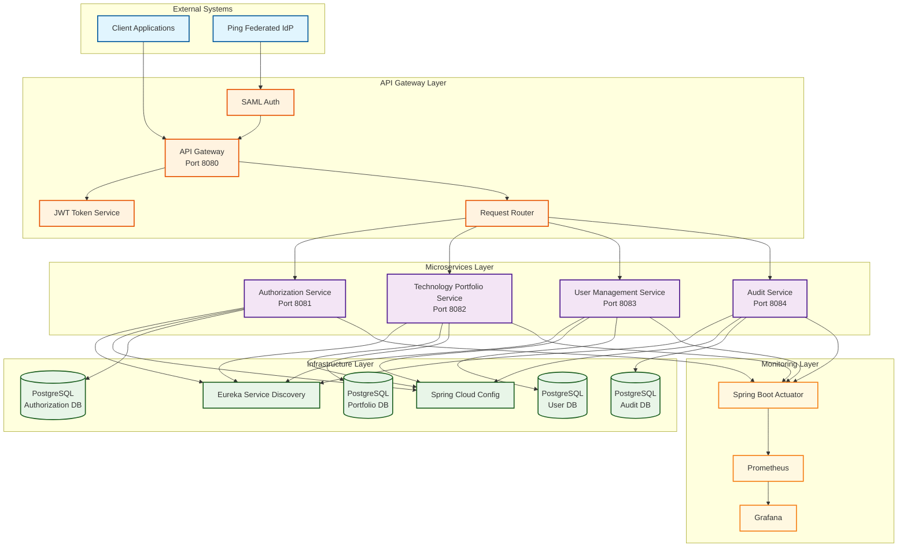

# Technology Portfolio Management with SSO Authentication

A microservices-based application for managing technology portfolios within a company, featuring Single Sign-On (SSO) authentication through Ping Federated Identity Provider using SAML 2.0.

## Architecture Overview

This application follows a microservices architecture pattern with the following components:

- **API Gateway** - Entry point with SSO integration and request routing
- **Authorization Service** - User permissions and role-based access control
- **Technology Portfolio Service** - Core business logic for portfolio management
- **User Management Service** - User profiles and organizational data
- **Audit Service** - Authentication and authorization event logging
- **Shared Module** - Common data models and utilities

## High-Level Architecture Diagram



### Architecture Components

#### **External Systems**
- **Client Applications**: Web applications, mobile apps, or third-party integrations
- **Ping Federated IdP**: External SAML 2.0 Identity Provider for SSO authentication

#### **API Gateway Layer**
- **API Gateway**: Single entry point for all client requests
- **SAML Auth**: Handles SAML 2.0 authentication flow
- **JWT Token Service**: Generates and validates JWT tokens
- **Request Router**: Routes authenticated requests to appropriate microservices

#### **Microservices Layer**
- **Authorization Service**: Manages user permissions and role-based access control
- **Technology Portfolio Service**: Core business logic for portfolio and technology management
- **User Management Service**: Handles user profiles and organizational data
- **Audit Service**: Logs authentication and authorization events

#### **Infrastructure Layer**
- **Eureka Service Discovery**: Service registration and discovery
- **Spring Cloud Config**: Centralized configuration management
- **PostgreSQL Databases**: Separate databases for each service (data isolation)

#### **Monitoring Layer**
- **Spring Boot Actuator**: Health checks and metrics endpoints
- **Prometheus**: Metrics collection and storage
- **Grafana**: Metrics visualization and dashboards

### Data Flow

1. **Authentication Flow**:
   - Client → API Gateway → Ping Federated IdP
   - IdP → API Gateway → JWT Token Generation
   - API Gateway → Client (with JWT token)

2. **Request Flow**:
   - Client → API Gateway (with JWT token)
   - API Gateway → Service Discovery → Target Microservice
   - Microservice → Database → Response
   - Response → API Gateway → Client

3. **Event Flow**:
   - Microservice → Event Publisher → Audit Service
   - Audit Service → Database (for compliance)

## Technology Stack

- **Spring Boot 3.4** - Application framework
- **Kotlin** - Programming language
- **Gradle** - Build tool
- **Spring Cloud Gateway** - API Gateway
- **Spring Security SAML** - SSO authentication
- **PostgreSQL** - Database
- **Eureka** - Service discovery
- **Resilience4j** - Circuit breaker
- **Prometheus** - Metrics collection

## Prerequisites

- Java 21 or higher
- Gradle 8.0 or higher
- PostgreSQL 14 or higher
- Docker (optional, for containerized deployment)

## Quick Start

### 1. Clone the Repository

```bash
git clone <repository-url>
cd tech-portfolio-sso
```

### 2. Database Setup

Create a PostgreSQL database and update the configuration in each service's `application.yml`:

```sql
CREATE DATABASE tech_portfolio;
CREATE DATABASE user_management;
CREATE DATABASE authorization;
CREATE DATABASE audit;
```

### 3. SAML Configuration

For development, you'll need to:

1. Set up Ping Federated Identity Provider (or use a test IdP)
2. Generate SAML certificates:
   ```bash
   # Generate signing key and certificate
   openssl genrsa -out saml-signing.key 2048
   openssl req -new -x509 -key saml-signing.key -out saml-signing.crt -days 365
   
   # Generate IdP verification certificate
   openssl req -new -x509 -key idp-verification.key -out idp-verification.crt -days 365
   ```

3. Place certificates in `api-gateway/src/main/resources/saml/`

### 4. Environment Variables

Set the following environment variables:

```bash
export JWT_SECRET="your-256-bit-secret-key-here"
export DB_PASSWORD="your-database-password"
export PING_FEDERATED_URL="https://your-ping-federated-instance.com"
```

### 5. Build and Run

```bash
# Build all services
./gradlew build

# Run services (in separate terminals)
./gradlew :api-gateway:bootRun
./gradlew :authorization-service:bootRun
./gradlew :technology-portfolio-service:bootRun
./gradlew :user-management-service:bootRun
./gradlew :audit-service:bootRun
```

## Service Configuration

### API Gateway (Port 8080)

The API Gateway handles:
- SSO authentication via SAML
- JWT token generation and validation
- Request routing to microservices
- Circuit breaker implementation

Key endpoints:
- `/saml/login` - SSO login
- `/saml/logout` - SSO logout
- `/api/portfolio/**` - Portfolio service routes
- `/api/auth/**` - Authorization service routes
- `/api/users/**` - User management routes
- `/api/audit/**` - Audit service routes

### Authorization Service (Port 8081)

Manages user permissions and role-based access control.

### Technology Portfolio Service (Port 8082)

Core business logic for managing technology portfolios, technologies, and assessments.

### User Management Service (Port 8083)

Handles user profiles, organizations, and organizational hierarchy.

### Audit Service (Port 8084)

Logs all authentication and authorization events for compliance.

## Development

### Project Structure

```
tech-portfolio-sso/
├── api-gateway/                 # API Gateway service
├── authorization-service/       # Authorization service
├── technology-portfolio-service/ # Portfolio management service
├── user-management-service/     # User management service
├── audit-service/              # Audit service
├── shared/                     # Shared models and utilities
├── build.gradle.kts           # Root build configuration
├── settings.gradle.kts        # Project settings
└── README.md                  # This file
```

### Adding a New Service

1. Create a new directory for the service
2. Add the service to `settings.gradle.kts`
3. Create `build.gradle.kts` with appropriate dependencies
4. Implement the service following the established patterns
5. Add routing configuration to the API Gateway

### Database Migrations

Each service uses Flyway for database migrations. Create migration scripts in:
```
service-name/src/main/resources/db/migration/
```

### Testing

Run tests for all services:
```bash
./gradlew test
```

Run tests for a specific service:
```bash
./gradlew :service-name:test
```

## Deployment

### Docker

Build Docker images:
```bash
./gradlew dockerBuild
```

Run with Docker Compose:
```bash
docker-compose up -d
```

### Kubernetes

Deploy to Kubernetes:
```bash
kubectl apply -f k8s/
```

## Monitoring

### Health Checks

Each service exposes health endpoints:
- `/actuator/health` - Service health
- `/actuator/info` - Service information
- `/actuator/metrics` - Service metrics

### Prometheus Metrics

Metrics are exposed at `/actuator/prometheus` for each service.

### Logging

Structured logging is configured with correlation IDs for request tracing.

## Security

### SAML Configuration

The application integrates with Ping Federated Identity Provider using SAML 2.0. Key security features:

- Signed SAML assertions
- Certificate-based verification
- Session management
- Token-based authentication

### JWT Tokens

After SAML authentication, JWT tokens are used for:
- Stateless authentication between services
- User context propagation
- Token refresh mechanism

### Authorization

Role-based access control (RBAC) with:
- User roles and permissions
- Resource-based access control
- Organizational hierarchy support

## Troubleshooting

### Common Issues

1. **SAML Configuration Errors**
   - Verify certificate paths and formats
   - Check IdP metadata URL accessibility
   - Ensure entity IDs match configuration

2. **Service Discovery Issues**
   - Verify Eureka server is running
   - Check service registration in Eureka dashboard
   - Ensure network connectivity between services

3. **Database Connection Issues**
   - Verify database credentials and connectivity
   - Check Flyway migration status
   - Ensure database schema is created

### Logs

Check service logs for detailed error information:
```bash
tail -f logs/service-name.log
```

## Contributing

1. Fork the repository
2. Create a feature branch
3. Make your changes
4. Add tests for new functionality
5. Submit a pull request

## License

This project is licensed under the MIT License - see the LICENSE file for details. 