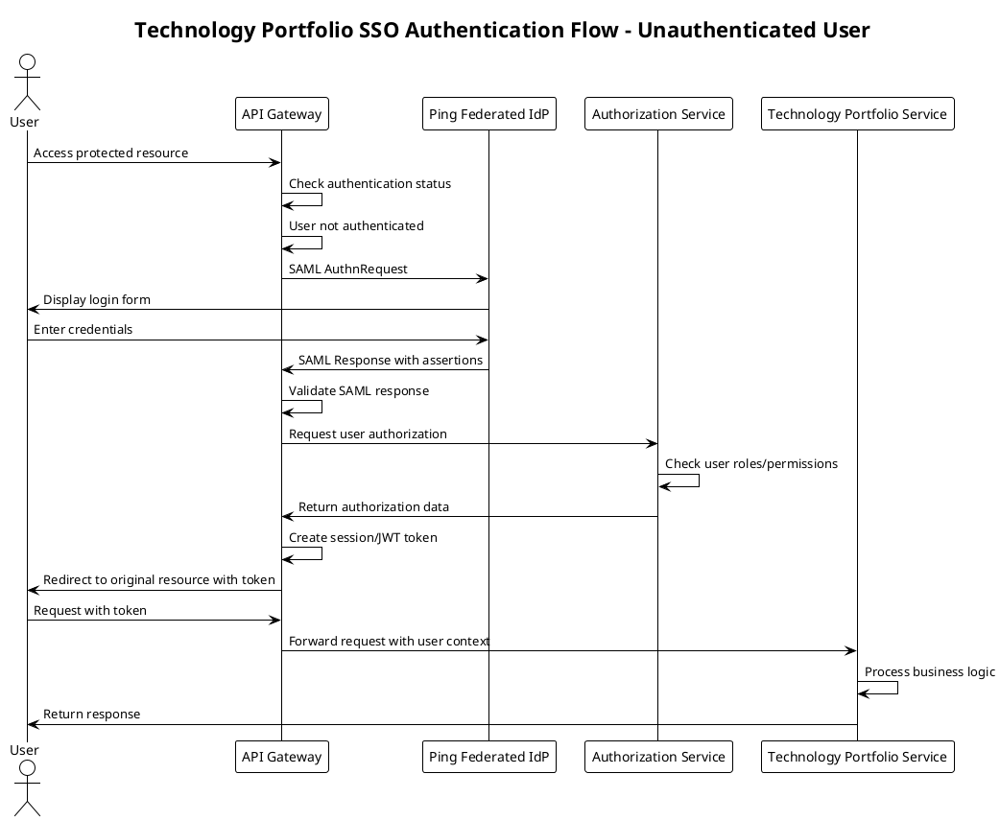
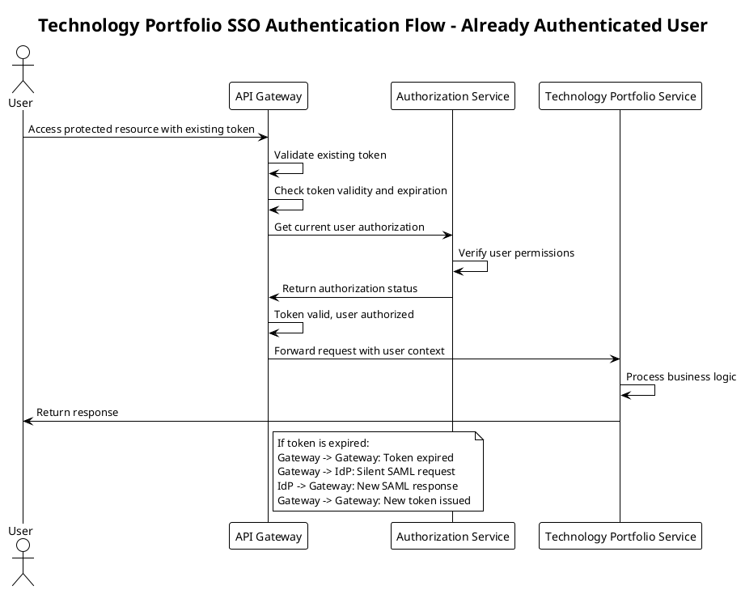

# SSO Authentication Architecture for Technology Portfolio Management

## Overview

This document outlines the high-level architecture design for a microservices application that manages technology portfolios within a company. The application leverages Single Sign-On (SSO) authentication through Ping Federated Identity Provider using SAML, while handling authorization internally.

## Architecture Components

### Core Technologies
- **Spring Boot 3.4** - Main application framework
- **Kotlin** - Primary programming language
- **Gradle** - Build tool and dependency management
- **Ping Federated Identity Provider** - External SSO provider
- **SAML 2.0** - Authentication protocol

### Microservices Architecture

The application is designed as a collection of microservices for resilience and scalability:

1. **API Gateway Service** - Entry point for all client requests, handles SSO integration and token management
2. **Authorization Service** - Manages user permissions and role-based access
3. **Technology Portfolio Service** - Core business logic for portfolio management
4. **User Management Service** - Handles user profiles and organizational data
5. **Audit Service** - Logs all authentication and authorization events

## Authentication Flows

### Flow 1: Unauthenticated User Access

This flow handles users who are not yet authenticated through SSO.

**Detailed Steps:**
1. User attempts to access a protected resource
2. API Gateway checks authentication status internally
3. If not authenticated, user is redirected to Ping Federated IdP
4. User completes SSO login at IdP
5. IdP sends SAML Response to API Gateway
6. API Gateway validates SAML assertions
7. Authorization Service determines user permissions
8. Session/JWT token is created and returned to user
9. User can now access protected resources

### Flow 2: Already Authenticated User Access

This flow handles users who have already completed SSO authentication.

**Detailed Steps:**
1. User presents existing authentication token
2. API Gateway validates token internally
3. If token is valid, Authorization Service confirms permissions
4. Request is forwarded to appropriate microservice
5. If token is expired, silent token refresh is initiated
6. New token is issued without user interaction
7. User continues with seamless access

## Security Considerations

### Token Management
- **JWT Tokens**: Used for stateless authentication between services
- **Token Expiration**: Configurable TTL with automatic refresh
- **Token Revocation**: Centralized token blacklisting for security incidents

### Authorization Model
- **Role-Based Access Control (RBAC)**: User roles determine access levels
- **Resource-Based Permissions**: Fine-grained permissions for portfolio items
- **Organizational Hierarchy**: Access based on organizational structure

### Audit and Compliance
- **Authentication Events**: All SSO events logged for compliance
- **Authorization Decisions**: Complete audit trail of access decisions
- **Data Access Logging**: Track all portfolio data access

## Implementation Guidelines

### Service Communication
- **Synchronous**: REST APIs for direct service-to-service communication
- **Asynchronous**: Event-driven communication for audit and notifications
- **Circuit Breakers**: Implemented for external IdP communication

### Data Flow
- **User Context**: Propagated through all service calls
- **Correlation IDs**: Track requests across service boundaries
- **Distributed Tracing**: Monitor performance and debug issues

### Configuration Management
- **Externalized Configuration**: Environment-specific settings
- **Feature Flags**: Dynamic feature enablement/disablement
- **Health Checks**: Service health monitoring and alerting

## Deployment Architecture

### Infrastructure
- **Container Orchestration**: Kubernetes for service deployment
- **Service Mesh**: Istio for service-to-service communication
- **Load Balancing**: Distributed across multiple instances
- **Auto-scaling**: Based on demand and performance metrics

### Monitoring and Observability
- **Metrics Collection**: Prometheus for performance monitoring
- **Log Aggregation**: Centralized logging with ELK stack
- **Distributed Tracing**: Jaeger for request tracing
- **Alerting**: Proactive monitoring and incident response

## Next Steps

The architecture is designed to be:
- **Scalable**: Horizontal scaling of individual services
- **Resilient**: Fault tolerance and graceful degradation
- **Secure**: Comprehensive security controls and audit trails
- **Maintainable**: Clear separation of concerns and modular design

This foundation provides a robust platform for technology portfolio management with enterprise-grade SSO authentication and authorization capabilities. 