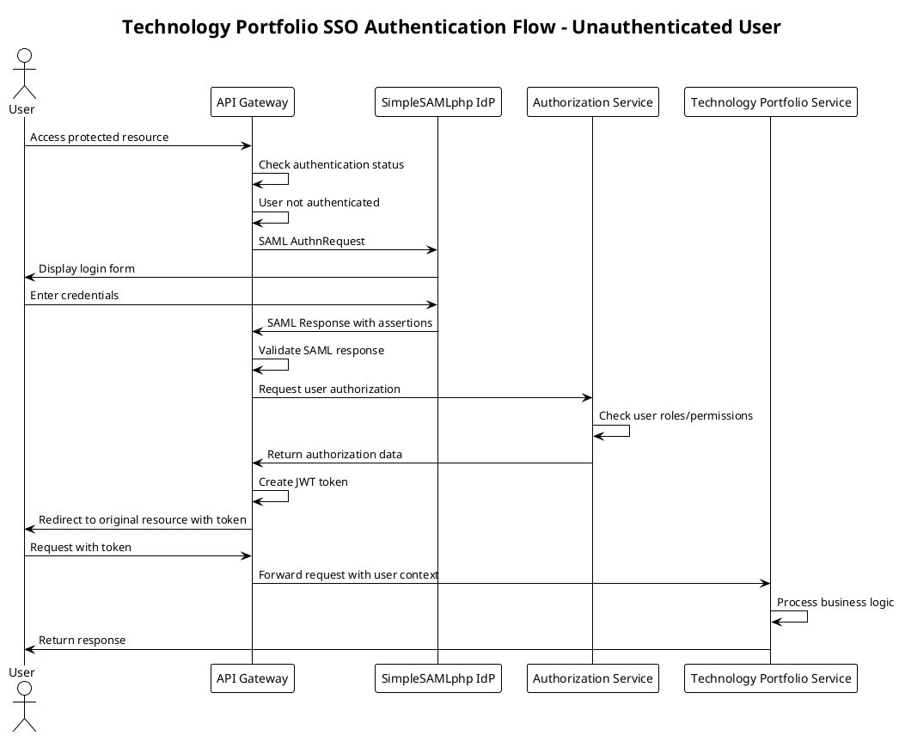
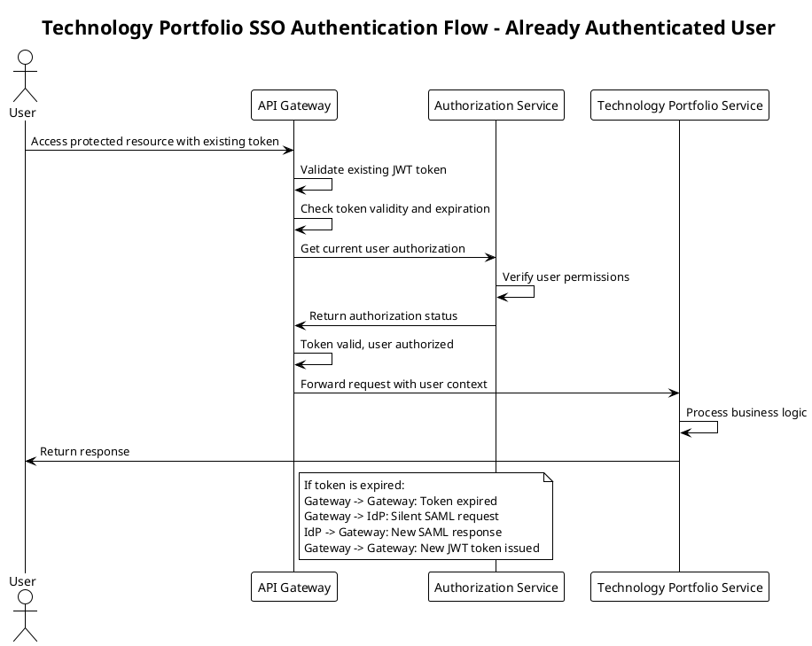
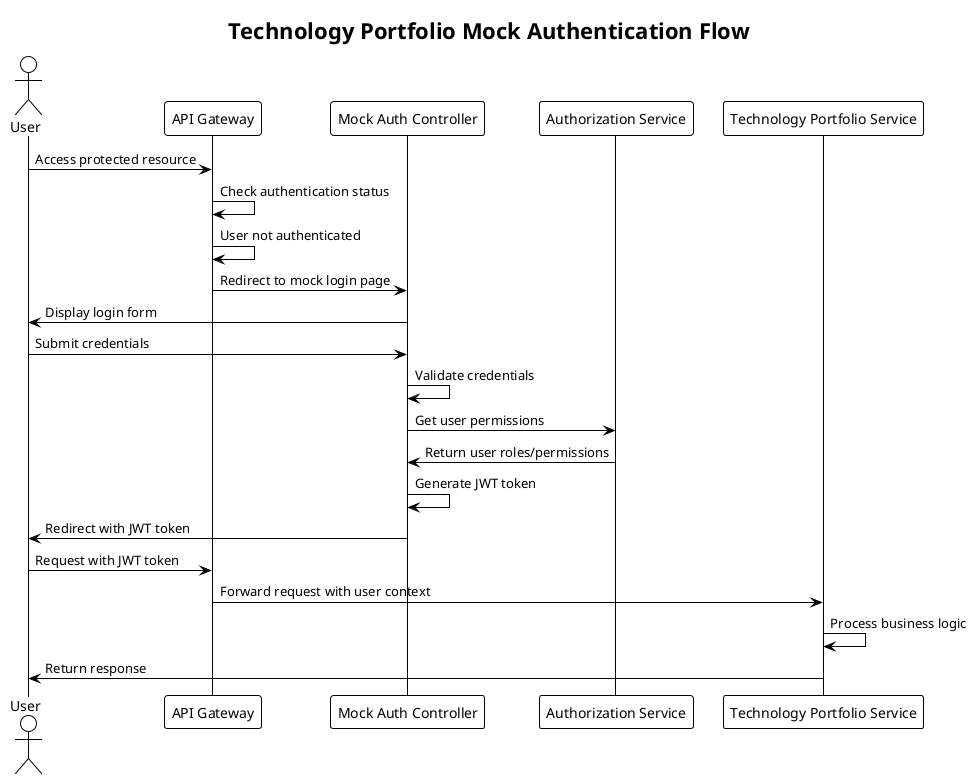

# SSO Authentication Architecture for Technology Portfolio Management

## Overview

This document outlines the high-level architecture design for a microservices application that manages technology portfolios within a company. The application leverages Single Sign-On (SSO) authentication through **SimpleSAMLphp Identity Provider** using SAML 2.0, while handling authorization internally. The system also supports a **Mock Authentication Mode** for development and testing purposes.

## Architecture Components

### Core Technologies
- **Spring Boot 3.4** - Main application framework
- **Kotlin 1.9.22** - Primary programming language
- **Gradle** - Build tool and dependency management
- **SimpleSAMLphp Identity Provider** - Open source SSO provider
- **SAML 2.0** - Authentication protocol
- **JWT** - Token-based authentication between services

### Microservices Architecture

The application is designed as a collection of microservices for resilience and scalability:

1. **API Gateway Service** (Port 8080) - Entry point for all client requests, handles SSO integration and token management
2. **Authorization Service** (Port 8082) - Manages user permissions and role-based access
3. **Technology Portfolio Service** (Port 8083) - Core business logic for portfolio management with reactive programming
4. **Shared Module** - Common domain models and interfaces

### Authentication Modes

The system supports two authentication modes:

1. **SAML SSO Mode** - Production-ready SAML 2.0 authentication with SimpleSAMLphp
2. **Mock Authentication Mode** - Development-friendly form-based authentication

## Authentication Flows

### Flow 1: Unauthenticated User Access (SAML Mode)

This flow handles users who are not yet authenticated through SSO.



**Detailed Steps:**
1. User attempts to access a protected resource
2. API Gateway checks authentication status internally
3. If not authenticated, user is redirected to SimpleSAMLphp IdP
4. User completes SSO login at IdP
5. IdP sends SAML Response to API Gateway
6. API Gateway validates SAML assertions
7. Authorization Service determines user permissions
8. JWT token is created and returned to user
9. User can now access protected resources

### Flow 2: Already Authenticated User Access

This flow handles users who have already completed SSO authentication.



**Detailed Steps:**
1. User presents existing JWT authentication token
2. API Gateway validates token internally
3. If token is valid, Authorization Service confirms permissions
4. Request is forwarded to appropriate microservice
5. If token is expired, silent token refresh is initiated
6. New JWT token is issued without user interaction
7. User continues with seamless access

### Flow 3: Mock Authentication Mode

This flow handles authentication in development mode without external IdP.



## Security Considerations

### Token Management
- **JWT Tokens**: Used for stateless authentication between services
- **Token Expiration**: Configurable TTL with automatic refresh
- **Token Security**: HMAC-SHA512 signing with configurable secret
- **Token Claims**: Username, authorities, session index, expiration

### Authorization Model
- **Role-Based Access Control (RBAC)**: User roles determine access levels
- **Permission-Based Authorization**: Fine-grained permissions for portfolio items
- **Organizational Hierarchy**: Access based on organizational structure

### Audit and Compliance
- **Authentication Events**: All SSO events logged for compliance
- **Authorization Decisions**: Complete audit trail of access decisions
- **Data Access Logging**: Track all portfolio data access
- **Event Publishing**: Domain events for security monitoring

## Implementation Guidelines

### Service Communication
- **Synchronous**: REST APIs for direct service-to-service communication
- **Asynchronous**: Event-driven communication for audit and notifications
- **Circuit Breakers**: Implemented for external IdP communication

### Data Flow
- **User Context**: Propagated through all service calls via JWT tokens
- **Correlation IDs**: Track requests across service boundaries
- **Distributed Tracing**: Monitor performance and debug issues

### Configuration Management
- **Profile-Based**: Different configurations for mock-auth and SAML modes
- **Externalized Configuration**: Environment-specific settings
- **Feature Flags**: Dynamic feature enablement/disablement
- **Health Checks**: Service health monitoring and alerting

## SAML Configuration

### SimpleSAMLphp Identity Provider

The system uses SimpleSAMLphp as the identity provider:

```yaml
# Docker Compose Configuration
identity-provider:
  image: kenchan0130/simplesamlphp
  ports:
    - "8080:8080"
  environment:
    SIMPLESAMLPHP_SP_ENTITY_ID: http://localhost:8080
    SIMPLESAMLPHP_SP_ASSERTION_CONSUMER_SERVICE: http://localhost:8080/saml/acs
    SIMPLESAMLPHP_SP_SINGLE_LOGOUT_SERVICE: http://localhost:8080/saml/logout
    SIMPLESAMLPHP_IDP_ADMIN_PASSWORD: admin123
```

### API Gateway SAML Configuration

```yaml
spring:
  security:
    saml2:
      relyingparty:
        registration:
          simplesamlphp:
            signing:
              credentials:
                - private-key-location: classpath:saml/saml-signing.key
                  certificate-location: classpath:saml/saml-signing.crt
            assertingparty:
              metadata-uri: ${SAML_IDP_METADATA_URL:http://identity-provider:8080/simplesaml/saml2/idp/metadata.php}
              entity-id: http://identity-provider:8080/simplesaml/saml2/idp/metadata.php
              verification:
                credentials:
                  - certificate-location: classpath:saml/idp-verification.crt
```

### Mock Authentication Configuration

For development and testing, the system supports mock authentication:

```yaml
# Mock Authentication Profile
spring:
  profiles:
    active: mock-auth

# Mock users configuration
mock:
  auth:
    users:
      - username: user1
        password: password
        roles: [ROLE_USER, READ_PORTFOLIO, WRITE_PORTFOLIO]
      - username: user2
        password: password
        roles: [ROLE_USER, READ_PORTFOLIO]
      - username: admin
        password: secret
        roles: [ROLE_ADMIN, READ_PORTFOLIO, WRITE_PORTFOLIO, DELETE_PORTFOLIO]
```

## Deployment Architecture

### Infrastructure
- **Container Orchestration**: Docker Compose for local development
- **Service Discovery**: Netflix Eureka for service registration
- **Load Balancing**: Distributed across multiple instances
- **Auto-scaling**: Based on demand and performance metrics

### Monitoring and Observability
- **Metrics Collection**: Prometheus for performance monitoring
- **Log Aggregation**: Centralized logging with structured output
- **Distributed Tracing**: Request tracing across service boundaries
- **Alerting**: Proactive monitoring and incident response

### Service URLs

| Service | URL | Description |
|---------|-----|-------------|
| **SimpleSAMLphp IdP** | http://localhost:8080/simplesaml/ | Identity Provider |
| **API Gateway** | http://localhost:8080 | Main application entry point |
| **Authorization Service** | http://localhost:8082 | User authorization |
| **Technology Portfolio Service** | http://localhost:8083 | Portfolio management |
| **Eureka Discovery** | http://localhost:8761 | Service registry |
| **Prometheus** | http://localhost:9090 | Metrics collection |
| **Grafana** | http://localhost:3000 | Monitoring dashboards |

## Testing and Development

### Test Users

Both authentication modes use the same test users:

| Username | Password | Role | Permissions |
|----------|----------|------|-------------|
| `user1` | `password` | Portfolio Manager | Read/Write portfolios, View analytics |
| `user2` | `password` | Viewer | Read-only access |
| `admin` | `secret` | Administrator | Full system access |

### Authentication Testing

#### SAML Authentication Testing

```bash
# 1. Initiate SAML login
curl -X GET http://localhost:8080/saml/login

# 2. Authenticate with SimpleSAMLphp
# Visit: http://localhost:8080/simplesaml/
# Login with test credentials

# 3. Use JWT token for API calls
curl -X GET http://localhost:8080/api/portfolios \
  -H "Authorization: Bearer YOUR_JWT_TOKEN"
```

#### Mock Authentication Testing

```bash
# 1. Get available test users
curl http://localhost:8080/api/auth/mock-users

# 2. Login programmatically
curl -X POST http://localhost:8080/api/auth/mock-login \
  -H 'Content-Type: application/json' \
  -d '{"username": "user1", "password": "password"}'

# 3. Use JWT token for API calls
curl -X GET http://localhost:8080/api/portfolios \
  -H 'Authorization: Bearer YOUR_JWT_TOKEN'
```

## Security Best Practices

### Production Considerations

1. **Replace Mock Authentication** with proper SAML IdP
2. **Use External Databases** (AWS RDS, etc.)
3. **Implement Proper TLS** certificates
4. **Configure Load Balancing**
5. **Set up Proper Monitoring**
6. **Use Strong JWT Secrets**
7. **Implement Token Revocation**
8. **Enable Audit Logging**

### SAML Security

- Generate proper SAML signing certificates
- Configure proper SP metadata with your IdP
- Use secure communication channels
- Implement proper session management
- Enable SAML logout flows

## Next Steps

The architecture is designed to be:
- **Scalable**: Horizontal scaling of individual services
- **Resilient**: Fault tolerance and graceful degradation
- **Secure**: Comprehensive security controls and audit trails
- **Maintainable**: Clear separation of concerns and modular design
- **Flexible**: Support for both SAML SSO and mock authentication

This foundation provides a robust platform for technology portfolio management with enterprise-grade SSO authentication and authorization capabilities, supporting both production SAML SSO and development-friendly mock authentication modes. 